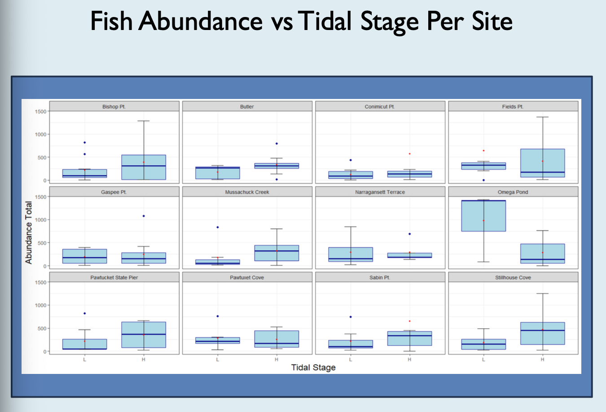
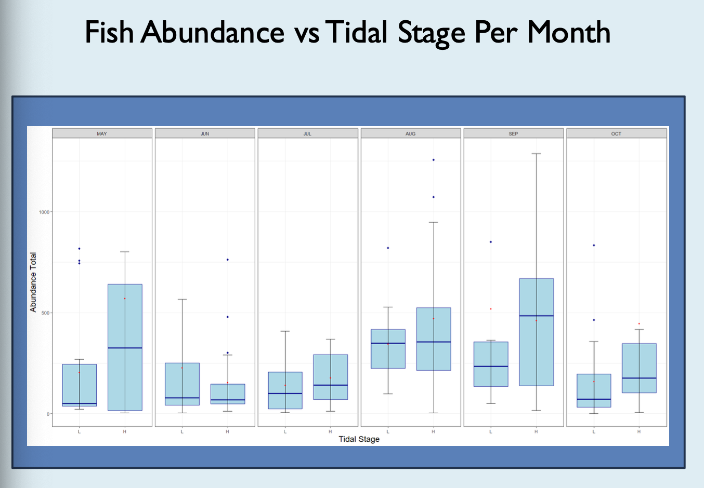
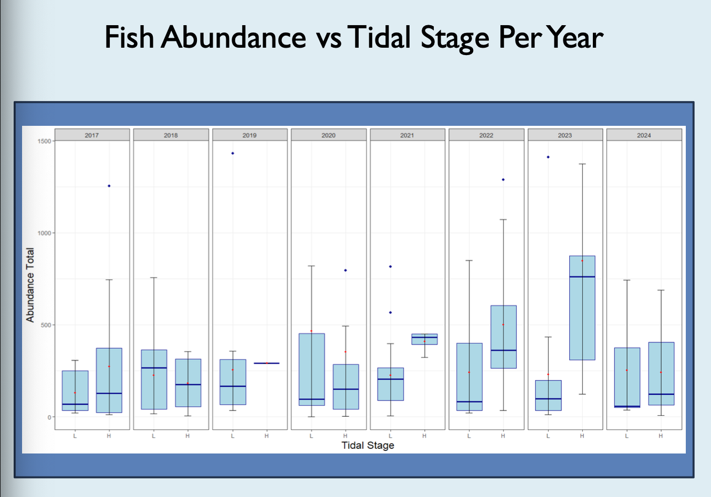
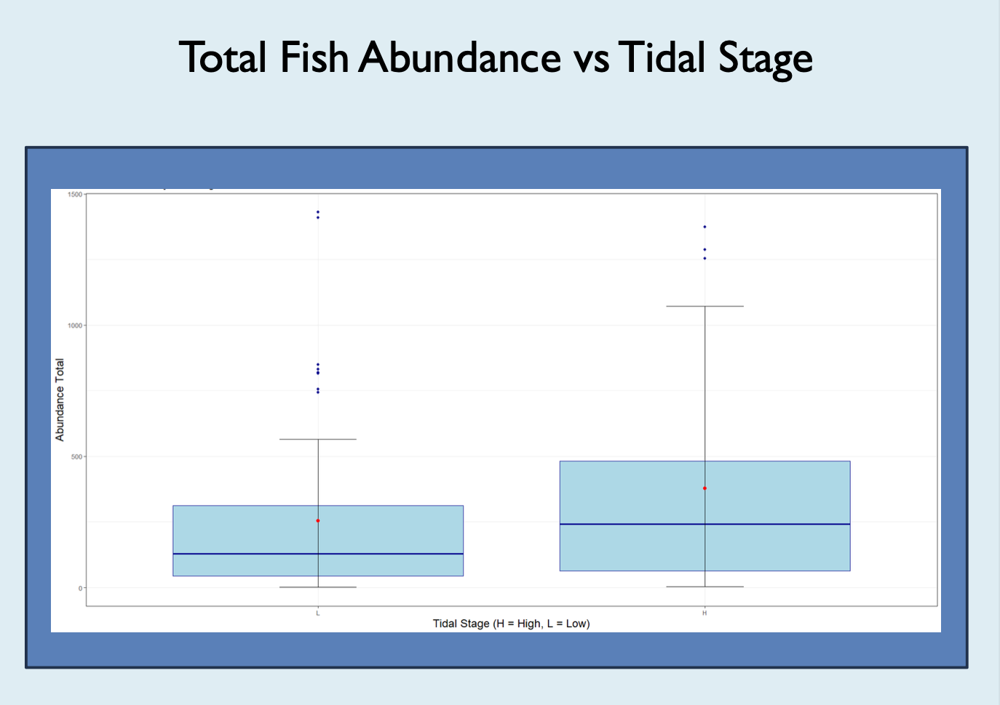

# Estuary-Fish-Tide-Analysis
Analyzing how tidal stage influences fish abundance across Rhode Island estuarine sites. I cleaned multi-year seine survey data, merged it with NOAA tidal records using fuzzy datetime matching, and modeled abundance using mixed effects to control for site, month, and year in R.

Simplified workflow for my Fish-tides-analysis-project:  

data_raw/    Unaltered input data (not public)  
&nbsp;    fish_raw.csv  
&nbsp;    tides_raw.csv  

data_processed/    Cleaned datasets  
&nbsp;    fish_clean.csv  
&nbsp;    tides_clean.csv  
  

R Scripts/    All merging, statistical testing  
&nbsp;    load_data.R  
&nbsp;    clean_fish.R  
&nbsp;    clean_tides.R  
&nbsp;    merge_fuzzy_tides.R  
&nbsp;    fish_tides_merged.R  
  
results/    Plotting, models, tables, and other analysis  
&nbsp;    models/  
&nbsp;    plots/  

communicating results/  
&nbsp;   
 
&nbsp;   

&nbsp;   

&nbsp;   
